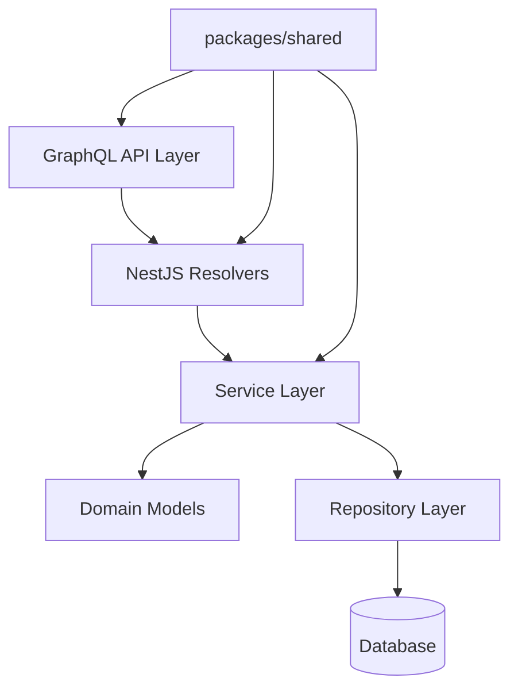
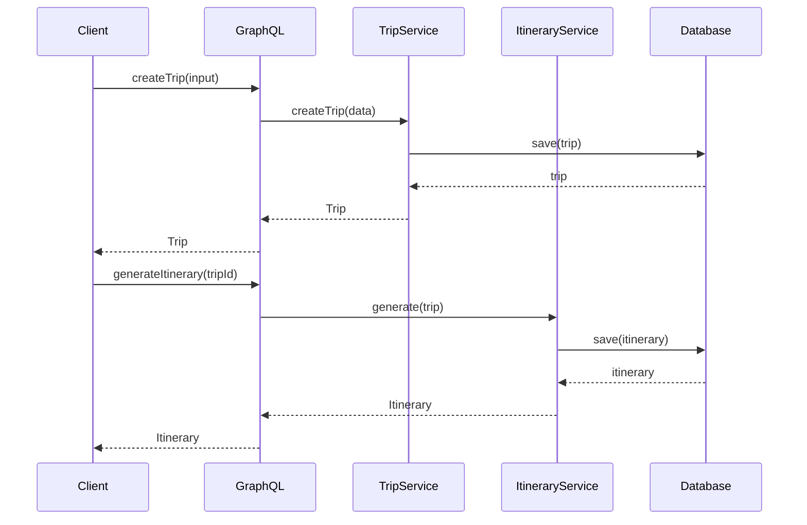

# Design Document: Travel Planner Backend

## Overview

A NestJS-based GraphQL backend for a travel planning application that enables users to create trips, manage destinations, plan itineraries, collaborate with travelers, and handle budget breakdowns. The system uses a monorepo structure with shared types in `packages/shared` and follows a domain-driven design approach with Trip as the root aggregate.

## Architecture



## Main Algorithm/Workflow




## Core Interfaces/Types

### GraphQL Schema (schema.graphql)

```graphql
# Enums
enum TripStatus {
  DRAFT
  PLANNED
  SHARED
}

enum BudgetTier {
  BUDGET
  MID_RANGE
  LUXURY
}

enum TravellerRole {
  ORGANIZER
  FRIEND
}

# Core Types
type Trip {
  id: ID!
  title: String!
  description: String
  status: TripStatus!
  startDate: String!
  endDate: String!
  destinations: [Destination!]!
  travellers: [Traveller!]!
  itinerary: Itinerary
  budgetBreakdown: BudgetBreakdown
  createdAt: String!
  updatedAt: String!
}

type Destination {
  id: ID!
  name: String!
  country: String!
  arrivalDate: String!
  departureDate: String!
  description: String
}

type Itinerary {
  id: ID!
  tripId: ID!
  days: [ItineraryDay!]!
  createdAt: String!
}

type ItineraryDay {
  id: ID!
  date: String!
  dayNumber: Int!
  activities: [Activity!]!
}

type Activity {
  id: ID!
  title: String!
  description: String
  startTime: String!
  endTime: String!
  location: String
  estimatedCost: Float
  currency: String
}

type Traveller {
  id: ID!
  name: String!
  email: String!
  role: TravellerRole!
  joinedAt: String!
}

type BudgetBreakdown {
  totalBudget: Float!
  currency: String!
  tier: BudgetTier!
  categories: [BudgetCategory!]!
}

type BudgetCategory {
  name: String!
  amount: Float!
  currency: String!
}

# Input Types
input CreateTripInput {
  title: String!
  description: String
  startDate: String!
  endDate: String!
  budgetTier: BudgetTier
}

input AddTravellerInput {
  tripId: ID!
  name: String!
  email: String!
  role: TravellerRole!
}

input PlanItineraryInput {
  tripId: ID!
  preferences: String
}

# Queries
type Query {
  getTrip(id: ID!): Trip
  suggestDestinations(query: String!, budget: Float, currency: String): [Destination!]!
  generateItinerary(input: PlanItineraryInput!): Itinerary
}

# Mutations
type Mutation {
  createTrip(input: CreateTripInput!): Trip!
  updateTrip(id: ID!, input: CreateTripInput!): Trip!
  addTraveller(input: AddTravellerInput!): Trip!
  removeTraveller(tripId: ID!, travellerId: ID!): Trip!
  sendTripEmail(tripId: ID!, recipientEmail: String!): Boolean!
}
```


### TypeScript Interfaces (packages/shared/src/types.ts)

```typescript
// Enums
export enum TripStatus {
  DRAFT = 'DRAFT',
  PLANNED = 'PLANNED',
  SHARED = 'SHARED',
}

export enum BudgetTier {
  BUDGET = 'BUDGET',
  MID_RANGE = 'MID_RANGE',
  LUXURY = 'LUXURY',
}

export enum TravellerRole {
  ORGANIZER = 'ORGANIZER',
  FRIEND = 'FRIEND',
}

// Core Interfaces
export interface Trip {
  id: string;
  title: string;
  description?: string;
  status: TripStatus;
  startDate: string; // ISO 8601
  endDate: string; // ISO 8601
  destinations: Destination[];
  travellers: Traveller[];
  itinerary?: Itinerary;
  budgetBreakdown?: BudgetBreakdown;
  createdAt: string; // ISO 8601
  updatedAt: string; // ISO 8601
}

export interface Destination {
  id: string;
  name: string;
  country: string;
  arrivalDate: string; // ISO 8601
  departureDate: string; // ISO 8601
  description?: string;
}

export interface Itinerary {
  id: string;
  tripId: string;
  days: ItineraryDay[];
  createdAt: string; // ISO 8601
}

export interface ItineraryDay {
  id: string;
  date: string; // ISO 8601
  dayNumber: number;
  activities: Activity[];
}

export interface Activity {
  id: string;
  title: string;
  description?: string;
  startTime: string; // ISO 8601
  endTime: string; // ISO 8601
  location?: string;
  estimatedCost?: number;
  currency?: string;
}

export interface Traveller {
  id: string;
  name: string;
  email: string;
  role: TravellerRole;
  joinedAt: string; // ISO 8601
}

export interface BudgetBreakdown {
  totalBudget: number;
  currency: string; // ISO 4217 currency code
  tier: BudgetTier;
  categories: BudgetCategory[];
}

export interface BudgetCategory {
  name: string;
  amount: number;
  currency: string; // ISO 4217 currency code
}

// Input Types
export interface CreateTripInput {
  title: string;
  description?: string;
  startDate: string; // ISO 8601
  endDate: string; // ISO 8601
  budgetTier?: BudgetTier;
}

export interface AddTravellerInput {
  tripId: string;
  name: string;
  email: string;
  role: TravellerRole;
}

export interface PlanItineraryInput {
  tripId: string;
  preferences?: string;
}
```


## Key Functions with Formal Specifications

### Function 1: createTrip()

```typescript
async createTrip(input: CreateTripInput): Promise<Trip>
```

**Preconditions:**
- `input.title` is non-empty string
- `input.startDate` is valid ISO 8601 date string
- `input.endDate` is valid ISO 8601 date string
- `input.endDate` >= `input.startDate`

**Postconditions:**
- Returns Trip object with unique `id`
- `trip.status` === TripStatus.DRAFT
- `trip.travellers` contains exactly one ORGANIZER (current user)
- `trip.destinations` is empty array
- `trip.createdAt` and `trip.updatedAt` are set to current timestamp

**Loop Invariants:** N/A

### Function 2: addTraveller()

```typescript
async addTraveller(input: AddTravellerInput): Promise<Trip>
```

**Preconditions:**
- Trip with `input.tripId` exists
- `input.email` is valid email format
- `input.name` is non-empty string
- Traveller with `input.email` not already in trip

**Postconditions:**
- Returns updated Trip object
- `trip.travellers` contains new traveller
- New traveller has `joinedAt` set to current timestamp
- Only one ORGANIZER exists per trip

**Loop Invariants:** N/A

### Function 3: generateItinerary()

```typescript
async generateItinerary(input: PlanItineraryInput): Promise<Itinerary>
```

**Preconditions:**
- Trip with `input.tripId` exists
- Trip has at least one destination
- Trip has valid `startDate` and `endDate`

**Postconditions:**
- Returns Itinerary object with unique `id`
- `itinerary.days.length` === number of days between startDate and endDate (inclusive)
- Each ItineraryDay has sequential `dayNumber` starting from 1
- Each ItineraryDay.date is within trip date range
- Trip.itinerary is updated with new itinerary

**Loop Invariants:**
- For day generation loop: All previously created days have sequential dates
- All day numbers are unique and sequential

### Function 4: validateTripDates()

```typescript
validateTripDates(startDate: string, endDate: string): boolean
```

**Preconditions:**
- `startDate` and `endDate` are provided (not null/undefined)

**Postconditions:**
- Returns `true` if and only if both dates are valid ISO 8601 and endDate >= startDate
- Returns `false` otherwise
- No side effects

**Loop Invariants:** N/A


## Algorithmic Pseudocode

### Main Trip Creation Algorithm

```typescript
async function createTrip(input: CreateTripInput, userId: string): Promise<Trip> {
  // Precondition checks
  if (!validateTripDates(input.startDate, input.endDate)) {
    throw new Error('Invalid trip dates');
  }
  
  if (!input.title || input.title.trim().length === 0) {
    throw new Error('Trip title is required');
  }
  
  // Create trip entity
  const trip: Trip = {
    id: generateUUID(),
    title: input.title.trim(),
    description: input.description,
    status: TripStatus.DRAFT,
    startDate: input.startDate,
    endDate: input.endDate,
    destinations: [],
    travellers: [
      {
        id: generateUUID(),
        name: getCurrentUserName(userId),
        email: getCurrentUserEmail(userId),
        role: TravellerRole.ORGANIZER,
        joinedAt: new Date().toISOString(),
      }
    ],
    budgetBreakdown: input.budgetTier ? {
      totalBudget: 0,
      currency: 'USD',
      tier: input.budgetTier,
      categories: [],
    } : undefined,
    createdAt: new Date().toISOString(),
    updatedAt: new Date().toISOString(),
  };
  
  // Persist to database
  const savedTrip = await tripRepository.save(trip);
  
  // Postcondition verification
  if (savedTrip.travellers.length !== 1 || 
      savedTrip.travellers[0].role !== TravellerRole.ORGANIZER) {
    throw new Error('Trip creation postcondition failed');
  }
  
  return savedTrip;
}
```

### Itinerary Generation Algorithm

```typescript
async function generateItinerary(input: PlanItineraryInput): Promise<Itinerary> {
  // Fetch trip
  const trip = await tripRepository.findById(input.tripId);
  
  if (!trip) {
    throw new Error('Trip not found');
  }
  
  if (trip.destinations.length === 0) {
    throw new Error('Trip must have at least one destination');
  }
  
  // Calculate trip duration
  const startDate = new Date(trip.startDate);
  const endDate = new Date(trip.endDate);
  const dayCount = Math.ceil((endDate.getTime() - startDate.getTime()) / (1000 * 60 * 60 * 24)) + 1;
  
  // Generate itinerary days
  const days: ItineraryDay[] = [];
  
  for (let i = 0; i < dayCount; i++) {
    // Loop invariant: All previous days have sequential dates and day numbers
    const currentDate = new Date(startDate);
    currentDate.setDate(startDate.getDate() + i);
    
    const day: ItineraryDay = {
      id: generateUUID(),
      date: currentDate.toISOString(),
      dayNumber: i + 1,
      activities: generateActivitiesForDay(trip, currentDate, input.preferences),
    };
    
    days.push(day);
  }
  
  // Create itinerary
  const itinerary: Itinerary = {
    id: generateUUID(),
    tripId: trip.id,
    days: days,
    createdAt: new Date().toISOString(),
  };
  
  // Save itinerary
  const savedItinerary = await itineraryRepository.save(itinerary);
  
  // Update trip with itinerary reference
  trip.itinerary = savedItinerary;
  await tripRepository.save(trip);
  
  // Postcondition verification
  if (savedItinerary.days.length !== dayCount) {
    throw new Error('Itinerary generation postcondition failed');
  }
  
  return savedItinerary;
}
```

### Traveller Management Algorithm

```typescript
async function addTraveller(input: AddTravellerInput): Promise<Trip> {
  // Fetch trip
  const trip = await tripRepository.findById(input.tripId);
  
  if (!trip) {
    throw new Error('Trip not found');
  }
  
  // Validate email format
  if (!isValidEmail(input.email)) {
    throw new Error('Invalid email format');
  }
  
  // Check for duplicate traveller
  const existingTraveller = trip.travellers.find(t => t.email === input.email);
  if (existingTraveller) {
    throw new Error('Traveller already exists in trip');
  }
  
  // Ensure only one organizer
  if (input.role === TravellerRole.ORGANIZER) {
    const hasOrganizer = trip.travellers.some(t => t.role === TravellerRole.ORGANIZER);
    if (hasOrganizer) {
      throw new Error('Trip already has an organizer');
    }
  }
  
  // Create new traveller
  const newTraveller: Traveller = {
    id: generateUUID(),
    name: input.name.trim(),
    email: input.email.toLowerCase(),
    role: input.role,
    joinedAt: new Date().toISOString(),
  };
  
  // Add to trip
  trip.travellers.push(newTraveller);
  trip.updatedAt = new Date().toISOString();
  
  // Save and return
  const updatedTrip = await tripRepository.save(trip);
  
  return updatedTrip;
}
```


## Example Usage

### Example 1: Creating a Trip

```typescript
// GraphQL Mutation
mutation {
  createTrip(input: {
    title: "Summer Europe Trip"
    description: "Exploring Paris, Rome, and Barcelona"
    startDate: "2024-07-01T00:00:00Z"
    endDate: "2024-07-15T00:00:00Z"
    budgetTier: MID_RANGE
  }) {
    id
    title
    status
    travellers {
      name
      role
    }
  }
}

// Response
{
  "data": {
    "createTrip": {
      "id": "trip-123",
      "title": "Summer Europe Trip",
      "status": "DRAFT",
      "travellers": [
        {
          "name": "John Doe",
          "role": "ORGANIZER"
        }
      ]
    }
  }
}
```

### Example 2: Adding Travellers

```typescript
// GraphQL Mutation
mutation {
  addTraveller(input: {
    tripId: "trip-123"
    name: "Jane Smith"
    email: "jane@example.com"
    role: FRIEND
  }) {
    id
    travellers {
      name
      email
      role
    }
  }
}
```

### Example 3: Generating Itinerary

```typescript
// GraphQL Query
query {
  generateItinerary(input: {
    tripId: "trip-123"
    preferences: "Focus on cultural activities and local cuisine"
  }) {
    id
    days {
      dayNumber
      date
      activities {
        title
        startTime
        endTime
        estimatedCost
        currency
      }
    }
  }
}
```

### Example 4: Complete Workflow

```typescript
// 1. Create trip
const trip = await createTrip({
  title: "Tokyo Adventure",
  startDate: "2024-09-01T00:00:00Z",
  endDate: "2024-09-07T00:00:00Z",
  budgetTier: BudgetTier.LUXURY,
});

// 2. Add travellers
await addTraveller({
  tripId: trip.id,
  name: "Alice Johnson",
  email: "alice@example.com",
  role: TravellerRole.FRIEND,
});

// 3. Generate itinerary
const itinerary = await generateItinerary({
  tripId: trip.id,
  preferences: "Mix of traditional and modern experiences",
});

// 4. Send trip details
await sendTripEmail(trip.id, "alice@example.com");
```


## NestJS Project Structure

```
travel-planner-backend/
├── packages/
│   └── shared/
│       └── src/
│           ├── types.ts          # Shared TypeScript interfaces
│           └── index.ts          # Export barrel
├── src/
│   ├── app.module.ts             # Root module
│   ├── main.ts                   # Application entry point
│   ├── common/
│   │   ├── decorators/           # Custom decorators
│   │   ├── guards/               # Auth guards
│   │   ├── filters/              # Exception filters
│   │   └── pipes/                # Validation pipes
│   ├── config/
│   │   ├── graphql.config.ts     # GraphQL configuration
│   │   └── database.config.ts    # Database configuration
│   ├── trips/
│   │   ├── trips.module.ts
│   │   ├── trips.resolver.ts     # GraphQL resolver
│   │   ├── trips.service.ts      # Business logic
│   │   ├── trips.repository.ts   # Data access
│   │   ├── entities/
│   │   │   └── trip.entity.ts    # Database entity
│   │   └── dto/
│   │       ├── create-trip.input.ts
│   │       └── update-trip.input.ts
│   ├── destinations/
│   │   ├── destinations.module.ts
│   │   ├── destinations.resolver.ts
│   │   ├── destinations.service.ts
│   │   └── entities/
│   │       └── destination.entity.ts
│   ├── itineraries/
│   │   ├── itineraries.module.ts
│   │   ├── itineraries.resolver.ts
│   │   ├── itineraries.service.ts
│   │   └── entities/
│   │       ├── itinerary.entity.ts
│   │       ├── itinerary-day.entity.ts
│   │       └── activity.entity.ts
│   ├── travellers/
│   │   ├── travellers.module.ts
│   │   ├── travellers.resolver.ts
│   │   ├── travellers.service.ts
│   │   └── entities/
│   │       └── traveller.entity.ts
│   ├── budget/
│   │   ├── budget.module.ts
│   │   ├── budget.service.ts
│   │   └── entities/
│   │       ├── budget-breakdown.entity.ts
│   │       └── budget-category.entity.ts
│   └── email/
│       ├── email.module.ts
│       └── email.service.ts
├── schema.graphql                # Generated GraphQL schema
├── package.json
├── tsconfig.json
└── nest-cli.json
```

## Correctness Properties

*A property is a characteristic or behavior that should hold true across all valid executions of a system—essentially, a formal statement about what the system should do. Properties serve as the bridge between human-readable specifications and machine-verifiable correctness guarantees.*

### Property 1: Trip Aggregate Consistency

For all trips, exactly one traveller with role ORGANIZER exists in the travellers list.

**Validates: Requirements 4.1, 4.2, 4.3, 4.4**

### Property 2: Date Validity

For all trips, the end date is greater than or equal to the start date when both are parsed as dates.

**Validates: Requirements 1.6, 2.2**

### Property 3: Itinerary Day Sequence

For all itineraries, the number of days equals the number of days between the trip's start and end dates (inclusive), and each day has a sequential day number starting from 1.

**Validates: Requirements 7.1, 7.2, 7.3, 7.4**

### Property 4: Unique Traveller Emails

For all trips, the number of travellers equals the number of unique email addresses (case-insensitive) in the travellers list.

**Validates: Requirements 5.1, 5.2**

### Property 5: Budget Currency Consistency

For all budget breakdowns, every budget category's currency code matches the breakdown's currency code.

**Validates: Requirements 10.1, 10.2, 10.3**

### Property 6: Activity Time Validity

For all activities, the end time is strictly after the start time when both are parsed as timestamps.

**Validates: Requirements 8.1, 8.2, 8.3**


## Currency Handling in BudgetBreakdown

### Overview
The BudgetBreakdown system uses ISO 4217 currency codes (e.g., USD, EUR, GBP, JPY) to handle multiple currencies consistently across the application.

### Design Principles

1. **Single Currency Per Trip**: Each trip's budget breakdown uses one primary currency
2. **Category Consistency**: All budget categories within a breakdown must use the same currency
3. **Activity Flexibility**: Individual activities can have costs in different currencies for display purposes
4. **Conversion Strategy**: Currency conversion is handled at the presentation layer, not in the domain model

### Implementation Details

```typescript
interface BudgetBreakdown {
  totalBudget: number;        // Total in primary currency
  currency: string;           // ISO 4217 code (e.g., "USD")
  tier: BudgetTier;
  categories: BudgetCategory[];
}

interface BudgetCategory {
  name: string;               // e.g., "Accommodation", "Food", "Transport"
  amount: number;             // Amount in primary currency
  currency: string;           // Must match BudgetBreakdown.currency
}

interface Activity {
  estimatedCost?: number;     // Cost in local currency
  currency?: string;          // ISO 4217 code for display
}
```

### Validation Rules

1. **Currency Code Validation**: All currency codes must be valid ISO 4217 codes
2. **Category Currency Match**: `budgetBreakdown.categories[*].currency === budgetBreakdown.currency`
3. **Non-Negative Amounts**: All budget amounts must be >= 0
4. **Category Sum**: Sum of category amounts should not exceed totalBudget (warning, not error)

### Currency Conversion Strategy

```typescript
// External service for real-time rates
interface CurrencyService {
  getExchangeRate(from: string, to: string): Promise<number>;
  convert(amount: number, from: string, to: string): Promise<number>;
}

// Usage in presentation layer
async function displayActivityCostInTripCurrency(
  activity: Activity,
  tripCurrency: string,
  currencyService: CurrencyService
): Promise<number> {
  if (!activity.estimatedCost || !activity.currency) {
    return 0;
  }
  
  if (activity.currency === tripCurrency) {
    return activity.estimatedCost;
  }
  
  return await currencyService.convert(
    activity.estimatedCost,
    activity.currency,
    tripCurrency
  );
}
```

### Example Scenarios

**Scenario 1: Single Currency Trip**
```typescript
const budget: BudgetBreakdown = {
  totalBudget: 5000,
  currency: 'USD',
  tier: BudgetTier.MID_RANGE,
  categories: [
    { name: 'Accommodation', amount: 2000, currency: 'USD' },
    { name: 'Food', amount: 1500, currency: 'USD' },
    { name: 'Transport', amount: 1000, currency: 'USD' },
    { name: 'Activities', amount: 500, currency: 'USD' },
  ]
};
```

**Scenario 2: Multi-Currency Activities**
```typescript
// Trip budget in USD
const tripBudget = { totalBudget: 5000, currency: 'USD', ... };

// Activities in local currencies
const activities = [
  { title: 'Eiffel Tower', estimatedCost: 25, currency: 'EUR' },
  { title: 'Louvre Museum', estimatedCost: 17, currency: 'EUR' },
  { title: 'Seine River Cruise', estimatedCost: 15, currency: 'EUR' },
];

// Convert for budget tracking
const totalInUSD = await Promise.all(
  activities.map(a => displayActivityCostInTripCurrency(a, 'USD', currencyService))
).then(costs => costs.reduce((sum, cost) => sum + cost, 0));
```

### Database Schema Considerations

```typescript
// Store currency as string column with CHECK constraint
@Entity()
class BudgetBreakdown {
  @Column('decimal', { precision: 10, scale: 2 })
  totalBudget: number;
  
  @Column('varchar', { length: 3 })
  @Check(`currency ~ '^[A-Z]{3}$'`)  // ISO 4217 format
  currency: string;
  
  @Column('enum', { enum: BudgetTier })
  tier: BudgetTier;
  
  @OneToMany(() => BudgetCategory, category => category.budgetBreakdown)
  categories: BudgetCategory[];
}
```


## Error Handling

### Error Scenario 1: Invalid Trip Dates

**Condition**: User attempts to create trip with endDate before startDate
**Response**: Throw `BadRequestException` with message "End date must be after or equal to start date"
**Recovery**: Client displays error and prompts user to correct dates

### Error Scenario 2: Duplicate Traveller

**Condition**: User attempts to add traveller with email already in trip
**Response**: Throw `ConflictException` with message "Traveller with this email already exists in trip"
**Recovery**: Client displays error and suggests updating existing traveller instead

### Error Scenario 3: Multiple Organizers

**Condition**: User attempts to add second ORGANIZER to trip
**Response**: Throw `BadRequestException` with message "Trip can only have one organizer"
**Recovery**: Client displays error and suggests FRIEND role instead

### Error Scenario 4: Trip Not Found

**Condition**: User queries non-existent trip ID
**Response**: Throw `NotFoundException` with message "Trip with ID {id} not found"
**Recovery**: Client redirects to trip list or displays 404 page

### Error Scenario 5: Itinerary Generation Without Destinations

**Condition**: User attempts to generate itinerary for trip with no destinations
**Response**: Throw `BadRequestException` with message "Cannot generate itinerary: trip has no destinations"
**Recovery**: Client prompts user to add destinations first

### Error Scenario 6: Invalid Currency Code

**Condition**: User provides invalid ISO 4217 currency code
**Response**: Throw `BadRequestException` with message "Invalid currency code: {code}"
**Recovery**: Client displays list of valid currency codes

## Testing Strategy

### Unit Testing Approach

Test each service method in isolation using mocked repositories and dependencies:

- **Trip Service Tests**: Test createTrip, updateTrip, addTraveller, removeTraveller with various inputs
- **Itinerary Service Tests**: Test generateItinerary with different trip configurations
- **Validation Tests**: Test date validation, email validation, currency code validation
- **Budget Service Tests**: Test budget calculations and currency consistency checks

**Coverage Goal**: 90% code coverage for service layer

**Key Test Cases**:
- Valid input scenarios (happy path)
- Invalid input scenarios (error handling)
- Edge cases (empty arrays, boundary dates, null values)
- Concurrent operations (race conditions)

### Property-Based Testing Approach

Use property-based testing to verify invariants hold across random inputs:

**Property Test Library**: fast-check (for TypeScript/JavaScript)

**Properties to Test**:
1. Trip date validity: `endDate >= startDate` for all generated trips
2. Unique traveller emails: No duplicate emails within trip
3. Single organizer: Exactly one ORGANIZER per trip
4. Itinerary completeness: Day count matches date range
5. Budget consistency: Category currencies match breakdown currency

**Example Property Test**:
```typescript
import * as fc from 'fast-check';

describe('Trip Properties', () => {
  it('should always have endDate >= startDate', () => {
    fc.assert(
      fc.property(
        fc.date(),
        fc.date(),
        (date1, date2) => {
          const startDate = date1 < date2 ? date1 : date2;
          const endDate = date1 < date2 ? date2 : date1;
          
          const trip = createTrip({
            title: 'Test Trip',
            startDate: startDate.toISOString(),
            endDate: endDate.toISOString(),
          });
          
          return new Date(trip.endDate) >= new Date(trip.startDate);
        }
      )
    );
  });
});
```

### Integration Testing Approach

Test complete workflows using test database and GraphQL API:

- **End-to-End Trip Creation**: Create trip → Add travellers → Generate itinerary → Send email
- **GraphQL Resolver Tests**: Test all queries and mutations through GraphQL layer
- **Database Integration**: Test repository methods with real database (test container)
- **External Service Mocking**: Mock currency conversion and email services

**Tools**: Jest, @nestjs/testing, apollo-server-testing, testcontainers


## Performance Considerations

### Database Optimization

1. **Indexing Strategy**:
   - Index on `Trip.id`, `Trip.status`, `Trip.createdAt`
   - Index on `Traveller.email` for duplicate checks
   - Composite index on `(Trip.id, Traveller.email)` for traveller lookups
   - Index on `Itinerary.tripId` for fast itinerary retrieval

2. **Query Optimization**:
   - Use eager loading for trip → destinations, travellers relationships
   - Implement pagination for trip lists (cursor-based)
   - Use DataLoader pattern to prevent N+1 queries in GraphQL

3. **Caching Strategy**:
   - Cache trip details with Redis (TTL: 5 minutes)
   - Cache currency exchange rates (TTL: 1 hour)
   - Invalidate cache on trip updates

### GraphQL Performance

1. **Query Complexity Limits**:
   - Maximum query depth: 5 levels
   - Maximum query complexity: 1000 points
   - Rate limiting: 100 requests per minute per user

2. **DataLoader Implementation**:
```typescript
@Injectable()
export class TripLoader {
  private readonly batchTrips = new DataLoader(async (ids: string[]) => {
    const trips = await this.tripRepository.findByIds(ids);
    return ids.map(id => trips.find(trip => trip.id === id));
  });
  
  async load(id: string): Promise<Trip> {
    return this.batchTrips.load(id);
  }
}
```

3. **Field-Level Caching**:
   - Cache expensive computed fields (e.g., budget totals)
   - Use @cacheControl directive for GraphQL fields

### Scalability Considerations

1. **Horizontal Scaling**: Stateless API servers behind load balancer
2. **Database Sharding**: Shard by user ID if needed for large scale
3. **Async Processing**: Use message queue (Bull/Redis) for email sending and itinerary generation
4. **CDN**: Cache static GraphQL schema and documentation

## Security Considerations

### Authentication & Authorization

1. **JWT-Based Authentication**:
   - Use JWT tokens with 1-hour expiration
   - Refresh tokens with 7-day expiration
   - Store refresh tokens in httpOnly cookies

2. **Authorization Rules**:
   - Only trip ORGANIZER can update trip details
   - Only trip ORGANIZER can add/remove travellers
   - All trip travellers can view trip details
   - Only authenticated users can create trips

3. **GraphQL Guards**:
```typescript
@Injectable()
export class TripOwnerGuard implements CanActivate {
  async canActivate(context: ExecutionContext): Promise<boolean> {
    const ctx = GqlExecutionContext.create(context);
    const { user } = ctx.getContext().req;
    const { tripId } = ctx.getArgs();
    
    const trip = await this.tripService.findById(tripId);
    const organizer = trip.travellers.find(t => t.role === TravellerRole.ORGANIZER);
    
    return organizer.email === user.email;
  }
}
```

### Input Validation

1. **GraphQL Input Validation**:
   - Use class-validator decorators on input DTOs
   - Validate email formats, date formats, currency codes
   - Sanitize string inputs to prevent XSS

2. **Rate Limiting**:
   - Implement rate limiting per user and per IP
   - Use @nestjs/throttler for request throttling

3. **SQL Injection Prevention**:
   - Use TypeORM parameterized queries
   - Never concatenate user input into queries

### Data Privacy

1. **PII Protection**:
   - Hash sensitive data (passwords if stored)
   - Encrypt email addresses at rest
   - Implement GDPR-compliant data deletion

2. **API Security**:
   - Enable CORS with whitelist
   - Use helmet.js for security headers
   - Implement CSRF protection for mutations

## Dependencies

### Core Dependencies

- **NestJS**: ^10.0.0 - Application framework
- **@nestjs/graphql**: ^12.0.0 - GraphQL integration
- **@nestjs/apollo**: ^12.0.0 - Apollo Server integration
- **apollo-server-express**: ^3.12.0 - GraphQL server
- **graphql**: ^16.8.0 - GraphQL implementation
- **TypeORM**: ^0.3.17 - ORM for database access
- **PostgreSQL**: ^8.11.0 - Database driver

### Utility Dependencies

- **class-validator**: ^0.14.0 - Input validation
- **class-transformer**: ^0.5.1 - Object transformation
- **uuid**: ^9.0.0 - UUID generation
- **date-fns**: ^2.30.0 - Date manipulation

### Testing Dependencies

- **Jest**: ^29.5.0 - Testing framework
- **@nestjs/testing**: ^10.0.0 - NestJS testing utilities
- **fast-check**: ^3.13.0 - Property-based testing
- **testcontainers**: ^10.2.0 - Integration testing with Docker

### Optional Dependencies

- **@nestjs/bull**: ^10.0.0 - Queue management
- **Redis**: ^4.6.0 - Caching and queues
- **nodemailer**: ^6.9.0 - Email sending
- **@nestjs/throttler**: ^5.0.0 - Rate limiting
- **helmet**: ^7.0.0 - Security headers
